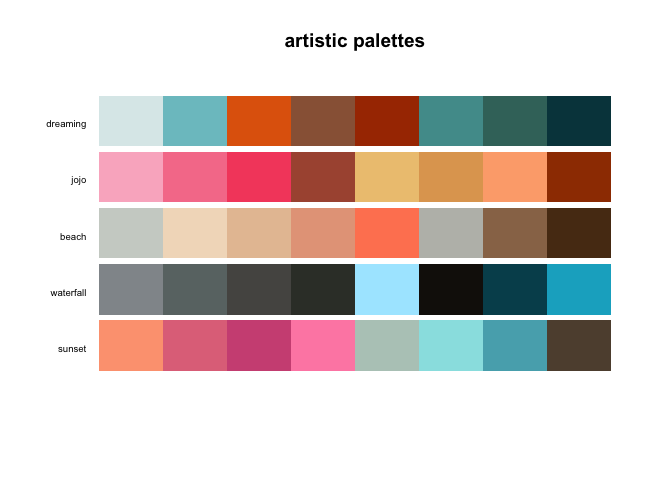
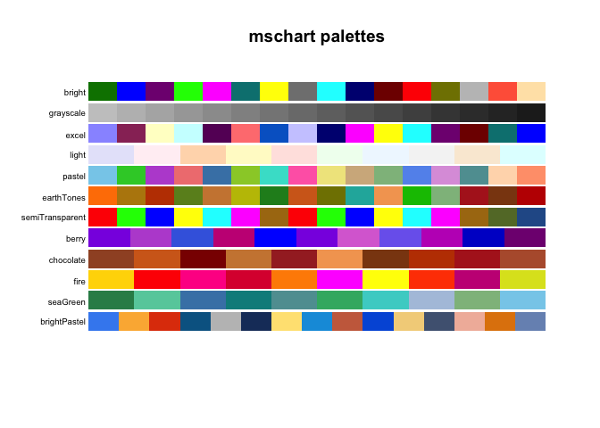

<!-- README.md is generated from README.Rmd. Please edit that file -->

# miscpalettes

The goal of miscpalettes is to have palettes that doesn’t fit in other
packages.

## Installation

You can install the developmental version on github,

``` r
library(remotes)
install_github("EmilHvitfeldt/miscpalettes")
```

When it is released, it can be downloaded from
[CRAN](https://CRAN.R-project.org) with:

``` r
install.packages("miscpalettes")
```

## Example

## Sample of palettes

And last but not least a handful of stylistic palettes.

``` r
pals::pal.bands(
  artistic[[1]],
  artistic[[2]],
  artistic[[3]],
  artistic[[4]],
  artistic[[5]],
  labels = names(artistic),
  main = "artistic palettes"
)
```



``` r
pals::pal.bands(
  mschart[[1]],
  mschart[[2]],
  mschart[[3]],
  mschart[[4]],
  mschart[[5]],
  mschart[[6]],
  mschart[[7]],
  mschart[[8]],
  mschart[[9]],
  mschart[[10]],
  mschart[[11]],
  mschart[[12]],
  labels = names(mschart),
  main = "mschart palettes"
)
```


